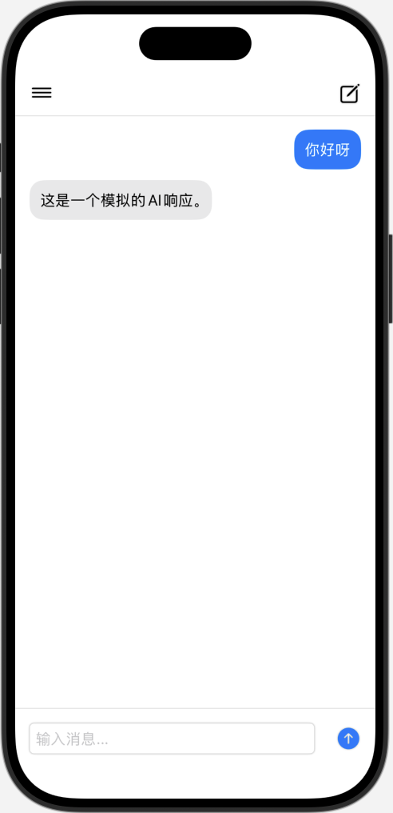

# AI Chat App

一个基于 SwiftUI 开发的 iOS 聊天应用，模仿 ChatGPT 的界面设计。

## 功能特点

- 简洁现代的用户界面
- 支持多个对话管理
- 实时消息显示
- 侧边栏对话列表
- 自动滚动到最新消息
- 响应式设计

## 界面预览

### 主聊天界面

_主聊天界面包含消息列表和输入框_

### 侧边栏

_侧边栏显示所有对话历史_

### 对话演示

_用户与 AI 的对话界面_

## 技术特点

- 使用 SwiftUI 构建的原生 iOS 应用
- MVVM 架构设计
- 响应式状态管理
- 自定义视图组件
- 动画过渡效果

## 项目结构
